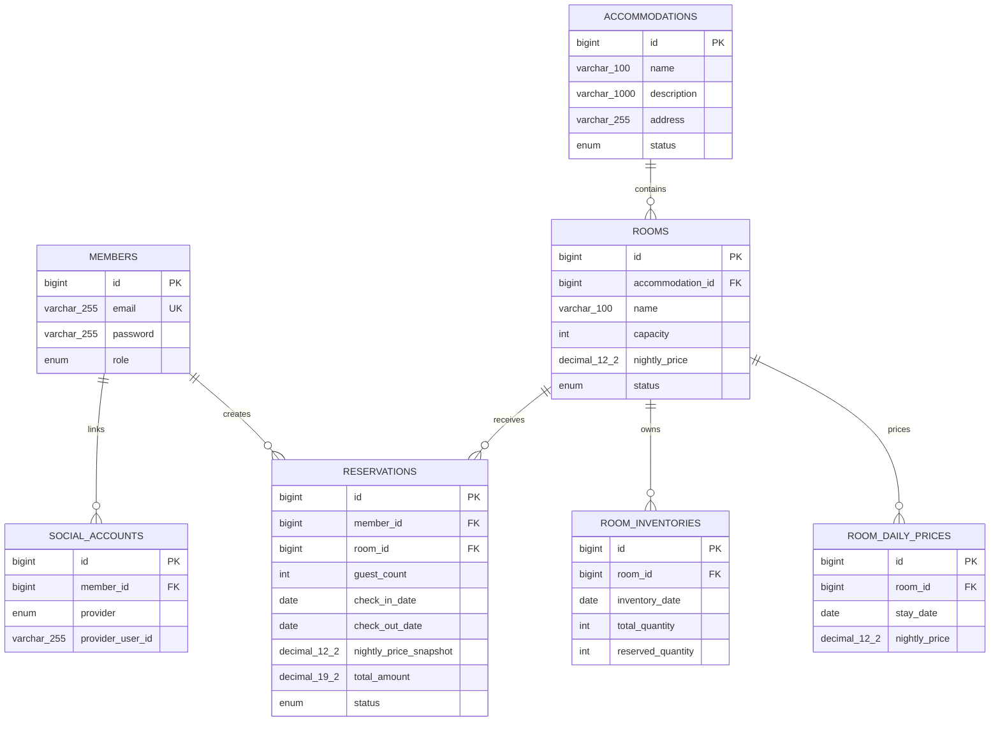

# Database Schema and Integrity Rules

이 문서는 현재 Entity 매핑과 MySQL 8.4 Schema의 제약조건, 인덱스 및 데이터
정합성 책임을 정리합니다. 소스의 Entity 매핑이 목표 Schema의 기준이며, 운영
환경에서는 검증된 Migration을 통해 동일한 제약조건을 적용해야 합니다.

## ERD

## Table Constraints

| Table | NOT NULL and length | UNIQUE | Foreign Key | CHECK |
| --- | --- | --- | --- | --- |
| `members` | email/password/role, email·password 255, role 20 | `uk_members_email(email)` | - | email은 trim 후 비어 있지 않고 password 길이는 1 이상 |
| `social_accounts` | member/provider/provider user ID, provider 20, provider user ID 255 | provider+provider user ID, member+provider | member → members | provider user ID는 trim 후 비어 있지 않음 |
| `accommodations` | name/description/address/status, 100/1000/255/20 | - | - | 세 문자열은 trim 후 비어 있지 않음 |
| `rooms` | accommodation/name/capacity/price/status, name 100, price `DECIMAL(12,2)` | - | accommodation → accommodations | name은 trim 후 비어 있지 않음, capacity ≥ 1, nightly price ≥ 0 |
| `room_inventories` | room/date/total/reserved | `uk_room_inventories_room_date(room_id, inventory_date)` | room → rooms | total ≥ 0, reserved ≥ 0, reserved ≤ total |
| `room_daily_prices` | room/stay date/price, price `DECIMAL(12,2)` | `uk_room_daily_prices_room_date(room_id, stay_date)` | room → rooms | nightly price > 0 |
| `reservations` | member/room/guest count/dates/prices/status, guest count `INT`, snapshot `DECIMAL(12,2)`, total `DECIMAL(19,2)` | - | member → members, room → rooms | guest count ≥ 1, check-in < check-out, snapshot·total ≥ 0 |

Enum은 모두 `EnumType.STRING`으로 저장합니다. MySQL에서는 현재 enum 값에 대응하는
`ENUM`, H2 테스트 Schema에서는 허용 값 CHECK가 생성됩니다. 숫자 enum ordinal은
사용하지 않으므로 enum 순서 변경이 저장값을 바꾸지 않습니다.

객실의 공개 생성·수정 API는 `nightlyPrice > 0`을 요구하지만 DB는 기존 개발
데이터 및 내부 호환성을 위해 `nightly_price >= 0`을 허용합니다. 예약 가격
Snapshot과 총액 역시 음수만 DB에서 차단합니다. 실제 총액 계산과 Snapshot 유지
규칙은 도메인 로직의 책임입니다.

날짜별 객실 가격은 공개 API와 DB 모두 양수만 허용합니다. 특정 객실·숙박일의
행이 없으면 객실의 기본 `nightly_price`로 fallback하며, 현재 예약 금액 계산은
날짜별 가격을 아직 사용하지 않습니다.

객실 `capacity`는 성인과 아동을 구분하지 않은 전체 최대 수용 인원이며, 예약
`guest_count`도 같은 기준의 전체 인원입니다. 공개 예약 API는 1명 이상인지 먼저
검증하고, Service는 객실의 `capacity`를 초과하지 않는지 생성과 일정 변경 시점에
검증합니다. 일정 변경은 예약 인원을 변경하지 않습니다.

날짜별 객실 재고는 전체 수량과 예약 수량만 저장하고 잔여 수량은 둘의 차이로
계산합니다. 전체 수량 0은 판매할 수 없는 날짜를 표현할 수 있도록 허용합니다.
동일 객실·날짜의 중복 행은 UNIQUE로 막으며, Service는 순차 요청에서 예약 수량이
전체 수량을 넘거나 반환 후 음수가 되지 않도록 검증합니다. 예약 생성·취소·일정
변경은 여러 날짜의 재고 변경과 Reservation 저장을 하나의 Transaction으로
처리합니다. 동시 요청 Lock은 아직 구현되지 않았습니다.

## Validation Responsibilities

| Layer | Responsibility |
| --- | --- |
| Request DTO | 필수 입력, 이메일 형식, 문자열 최대 길이, 페이지 범위, 공개 API의 양수 가격처럼 사용자에게 즉시 설명할 수 있는 입력 검증 |
| Domain and Service | 예약 `[check-in, check-out)` 규칙, 가격 Snapshot·총액 계산, 상태 전이, 소유권, 운영 상태, 전체 숙박일 재고 존재·잔여 수량, 예약 인원과 객실 수용 인원 비교처럼 여러 값·Entity·현재 상태가 필요한 비즈니스 규칙 |
| Database | NOT NULL, UNIQUE, FK, 컬럼 길이, enum 허용값, 음수 금액·잘못된 날짜처럼 어떤 쓰기 경로에서도 깨지면 안 되는 최종 정합성 보장 |

DB CHECK는 예약 총액이 `Snapshot × 숙박 일수`인지 또는 날짜별 예약 수량 합계가
전체 재고를 넘는지 검증하지 않습니다. 현재 Service Transaction은 순차 요청의
정합성을 보장하며 동시 요청 Race Condition은 이후 Lock 전략으로 다룹니다.

## Index Review

| Index | Supported query | Decision |
| --- | --- | --- |
| `uk_members_email(email)` | 회원가입 중복 확인, 이메일 로그인 | UNIQUE가 인덱스를 제공하므로 별도 email 인덱스 없음 |
| 소셜 계정 UNIQUE 2개 | provider 계정 조회, 회원별 provider 중복 방지 | 조회와 정합성에 모두 필요 |
| rooms의 accommodation FK 인덱스 | 숙소별 객실 목록과 예약 가능 객실 후보 축소 | MySQL이 FK 인덱스를 제공하므로 중복 인덱스 없음 |
| `uk_room_inventories_room_date(room_id,inventory_date)` | 객실·날짜 단건 조회와 기간 범위 조회 | UNIQUE가 room 선두 복합 인덱스를 제공하므로 별도 인덱스 없음 |
| `uk_room_daily_prices_room_date(room_id,stay_date)` | 객실·날짜 적용 가격 조회와 기간 범위 조회 | UNIQUE가 room 선두 복합 인덱스를 제공하므로 별도 인덱스 없음 |
| `idx_reservations_member(member_id)` | JWT 회원 기준 본인 예약 조회 | 모든 예약 목록 조건의 필수 선두 조건이므로 유지 |

숙소명 검색은 `lower(name) like '%keyword%'`이므로 일반 B-tree name 인덱스의
효과를 기대하기 어렵습니다. 선택적인 예약 상태·날짜·금액 정렬마다 복합 인덱스를
추가하면 쓰기 비용과 중복 인덱스가 늘어나므로 현재 트래픽 측정 없이 추가하지
않습니다. 실행 계획과 데이터 분포가 확보되면 인덱스를 다시 검토합니다.

기간 중복 및 가용 객실 조회가 `reservations`가 아닌 `room_inventories`를 기준으로
변경되어 새 Schema는 기존 room/status/period 예약 인덱스를 생성하지 않습니다.
기존 개발 Volume에 남아 있는 해당 인덱스는 정합성에는 영향을 주지 않으며, 실제
실행 계획과 운영 절차를 검토한 Migration에서 제거합니다.

## Existing Local Database Upgrade

새 DB는 Entity 매핑으로 위 CHECK를 생성하지만 Hibernate `ddl-auto=update`는 이미
존재하는 테이블에 CHECK를 소급 적용하지 않습니다. 기존 Docker Volume에는 먼저
잘못된 데이터가 없는지 확인한 다음
[`mysql-schema-hardening.sql`](mysql-schema-hardening.sql)을 한 번 적용합니다.

`guest_count` 추가 전 생성된 기존 예약 테이블은 애플리케이션 갱신 전에
[`mysql-guest-count-upgrade.sql`](mysql-guest-count-upgrade.sql)을 한 번 적용합니다.
기존 예약은 과거 API에 인원 정보가 없었으므로 보수적인 호환값인 1명으로
Backfill합니다. 실행 전 조회 결과와 Backup을 확인해야 하며, 이미 컬럼 또는
제약조건이 존재하면 해당 ALTER 문을 다시 실행하지 않습니다.

현재 프로젝트에는 Flyway 같은 Migration 도구가 없습니다. 이 SQL은 기존 개발
DB 보강을 위한 명시적 일회성 스크립트이며 애플리케이션 시작 시 자동 실행되지
않습니다. 운영 배포 전에는 정식 Migration 도구 도입, Schema baseline 작성,
`ddl-auto=validate` 전환을 별도 ADR과 Issue로 결정해야 합니다.

기존 Volume의 `social_accounts.member_id` FK는 Hibernate가 과거에 생성한 이름을
유지할 수 있습니다. 제약의 대상과 동작은 동일하며, 새 Schema에서는 Entity에
명시한 `fk_social_accounts_member` 이름으로 생성됩니다.

`room_inventories`와 `room_daily_prices`는 기존 테이블 변경이 아닌 새 테이블이므로
현재 개발 설정의 `ddl-auto=update`에서 생성됩니다. 데이터가 있는 환경이나 운영
환경에는 자동 Schema 갱신을 의존하지 말고 정식 Migration 도입 후 동일한
FK·UNIQUE·CHECK를 명시적으로 적용해야 합니다.
