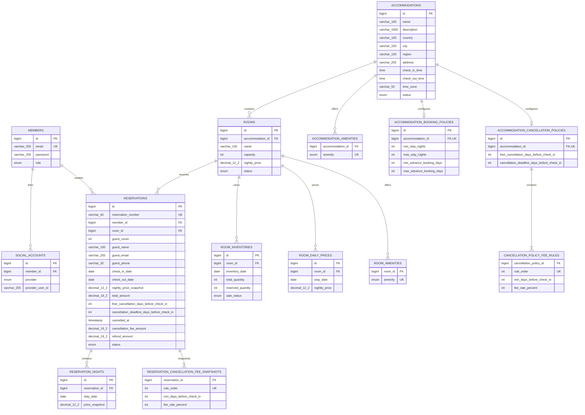

# Database Schema and Integrity Rules

이 문서는 현재 Entity 매핑과 MySQL 8.4 Schema의 제약조건, 인덱스 및 데이터
정합성 책임을 정리합니다. 소스의 Entity 매핑이 목표 Schema의 기준이며, 운영
환경에서는 검증된 Migration을 통해 동일한 제약조건을 적용해야 합니다.

## ERD

## Table Constraints

| Table | NOT NULL and length | UNIQUE | Foreign Key | CHECK |
| --- | --- | --- | --- | --- |
| `members` | email/password/role, email·password 255, role 20 | `uk_members_email(email)` | - | email은 trim 후 비어 있지 않고 password 길이는 1 이상 |
| `social_accounts` | member/provider/provider user ID, provider 20, provider user ID 255 | provider+provider user ID, member+provider | member → members | provider user ID는 trim 후 비어 있지 않음 |
| `accommodations` | name/description/address/status/time zone 필수, country/city/region 및 운영시간 nullable 호환 필드, 100/1000/255/50/20 | - | - | 기존 필수 문자열과 TimeZone은 trim 후 비어 있지 않음, 운영시간은 모두 null이거나 모두 존재하면서 서로 다름 |
| `accommodation_amenities` | accommodation/amenity | accommodation+amenity | accommodation → accommodations | enum 허용 값 |
| `accommodation_booking_policies` | accommodation과 네 정책 경계값 | `uk_booking_policies_accommodation(accommodation_id)` | accommodation → accommodations | 최소 숙박일 ≥ 1, 최대 숙박일 ≥ 최소 숙박일, 최소 사전 예약일 ≥ 0, 최대 사전 예약일 ≥ 최소 사전 예약일 |
| `accommodation_cancellation_policies` | accommodation, 무료 취소·취소 마감 기준 | `uk_cancellation_policies_accommodation(accommodation_id)` | accommodation → accommodations | 취소 마감 ≥ 0, 무료 취소 기준 > 취소 마감 |
| `cancellation_policy_fee_rules` | 정책, 순서, 구간 시작일, 정수 요율 | policy+order | policy → accommodation cancellation policies | 구간 시작일 ≥ 0, 요율 1~100 |
| `rooms` | accommodation/name/capacity/price/status, name 100, price `DECIMAL(12,2)` | - | accommodation → accommodations | name은 trim 후 비어 있지 않음, capacity ≥ 1, nightly price ≥ 0 |
| `room_amenities` | room/amenity | room+amenity | room → rooms | enum 허용 값 |
| `room_inventories` | room/date/total/reserved/sale status | `uk_room_inventories_room_date(room_id, inventory_date)` | room → rooms | total ≥ 0, reserved ≥ 0, reserved ≤ total |
| `room_daily_prices` | room/stay date/price, price `DECIMAL(12,2)` | `uk_room_daily_prices_room_date(room_id, stay_date)` | room → rooms | nightly price > 0 |
| `reservations` | 공개 예약번호/member/room/guest count/dates/prices/cancellation policy·result/status 필수, 대표 투숙객은 레거시 호환 nullable | `uk_reservations_reservation_number(reservation_number)` | member → members, room → rooms | 예약번호와 입력된 대표 투숙객 값은 trim 후 비어 있지 않음, 대표 투숙객은 전부 null이거나 전부 존재, guest count ≥ 1, check-in < check-out, 가격·취소 수수료·환불액 ≥ 0, 취소 마감 ≥ 0, 무료 취소 기준 > 취소 마감 |
| `reservation_nights` | reservation/stay date/price snapshot | `uk_reservation_nights_reservation_date(reservation_id, stay_date)` | reservation → reservations | price snapshot ≥ 0 |
| `reservation_cancellation_fee_snapshots` | 예약, 순서, 구간 시작일, 정수 요율 | reservation+order | reservation → reservations | 구간 시작일 ≥ 0, 요율 1~100 |

Enum은 모두 `EnumType.STRING`으로 저장합니다. MySQL에서는 현재 enum 값에 대응하는
`ENUM`, H2 테스트 Schema에서는 허용 값 CHECK가 생성됩니다. 숫자 enum ordinal은
사용하지 않으므로 enum 순서 변경이 저장값을 바꾸지 않습니다.

숙소 위치는 국가·도시·지역·상세 주소로 구분합니다. 기존 `address` 컬럼은 상세
주소로 재사용하며, 구조화 이전 데이터의 국가·도시·지역은 정확한 자동 분리가
불가능해 nullable로 유지합니다. 신규 API는 네 위치 필드를 모두 요구합니다.
숙소와 객실 편의시설은 책임별 enum 및 관계 테이블로 분리하고 등록·전체 수정 시
목록 전체를 교체합니다.

신규 숙소 등록·수정 API는 체크인·체크아웃 시간을 모두 요구하며 두 시간은 서로
달라야 합니다. 체크인과 체크아웃은 서로 다른 숙박일에 적용되므로 `15:00` 체크인과
`11:00` 체크아웃처럼 체크인 시각이 더 늦은 구성이 유효합니다. 구조화 이전 숙소는
검증되지 않은 시간을 추정하지 않고 nullable로 유지합니다.

숙소의 `time_zone`은 Java `ZoneId`가 인식하는 IANA 지역 ID를 저장합니다. 신규 API는
유효한 값을 필수로 요구하고 Domain에서도 다시 검증합니다. 기존 숙소는 종전의
애플리케이션 전역 날짜 정책을 그대로 보존하기 위해 `Asia/Seoul`로 Backfill합니다.

객실의 공개 생성·수정 API는 `nightlyPrice > 0`을 요구하지만 DB는 기존 개발
데이터 및 내부 호환성을 위해 `nightly_price >= 0`을 허용합니다. 예약 가격
Snapshot과 총액 역시 음수만 DB에서 차단합니다. 실제 총액 계산과 Snapshot 유지
규칙은 도메인 로직의 책임입니다.

날짜별 객실 가격은 공개 API와 DB 모두 양수만 허용합니다. 예약 금액은 특정
객실·숙박일의 행이 있으면 해당 가격을, 없으면 객실 기본 `nightly_price`를
사용하여 모든 `[check-in, check-out)` 숙박일 금액을 합산합니다.

예약의 `nightly_price_snapshot`은 예약 또는 일정 변경 시점의 첫 숙박일 적용
가격이고, `total_amount`는 전체 숙박일 가격을 합한 확정 금액 Snapshot입니다.
각 날짜와 적용 가격은 `reservation_nights`에 저장하며 Domain은 그 합계와
`total_amount`, 첫 행과 `nightly_price_snapshot`, 날짜 목록과 예약 기간이 일치하는지
검증합니다. 원본 가격이 변경되어도 Snapshot은 자동으로 바뀌지 않습니다. 일정
변경 시 새 기간 전체를 현재 가격으로 다시 계산하고 자식 행을 재구성합니다.

예약 생성 시 숙소의 현재 취소 정책 기준값과 수수료 구간도 복제합니다. 숙소 정책
수정은 기존 예약의 Snapshot을 변경하지 않으며 일정 변경도 Snapshot을 유지합니다.
정책이 없는 숙소는 기존 전역 취소 규칙을 기본 Snapshot으로 사용합니다.
허용된 취소는 UTC 시각, 실제 수수료와 예상 환불액을 nullable 결과 컬럼에 저장합니다.
확정 예약과 업그레이드 전 기존 취소 예약에는 이 결과 컬럼이 `NULL`일 수 있습니다.

객실 `capacity`는 성인과 아동을 구분하지 않은 전체 최대 수용 인원이며, 예약
`guest_count`도 같은 기준의 전체 인원입니다. 공개 예약 API는 1명 이상인지 먼저
검증하고, Service는 객실의 `capacity`를 초과하지 않는지 생성과 일정 변경 시점에
검증합니다. 일정 변경은 예약 인원을 변경하지 않습니다.

신규 예약에는 내부 PK와 분리된 `RSV-yyyyMMdd-XXXXXXXXXXXXXXXX` 공개 예약번호를
숙소 TimeZone 기준으로 발급합니다. 16자리 대문자 16진 UUID 조각으로 충돌 가능성을 낮추고
DB UNIQUE를 최종 방어선으로 사용합니다. 번호는 일정 변경·취소 후에도 바뀌지
않습니다. 예약 소유자인 Member와 실제 대표 투숙객은 별개이며 이름·안내 이메일·
연락처만 예약에 저장합니다.

날짜별 객실 재고는 전체 수량, 예약 수량과 `OPEN/CLOSED` 판매 상태를 저장하고
잔여 수량은 두 수량의 차이로 계산합니다. 신규 행은 `OPEN`이며, 전체 수량 0과
운영자가 명시한 `CLOSED`를 서로 다른 상태로 표현합니다.
동일 객실·날짜의 중복 행은 UNIQUE로 막으며, Service는 순차 요청에서 예약 수량이
전체 수량을 넘거나 반환 후 음수가 되지 않도록 검증합니다. `CLOSED` 재고는 신규
예약 대상에서 제외하지만 기존 예약과 예약 수량은 변경하지 않습니다. 예약 생성·취소·일정
변경은 여러 날짜의 재고 변경과 Reservation 저장을 하나의 Transaction으로
처리합니다. 동시 요청 Lock은 아직 구현되지 않았습니다.

## Validation Responsibilities

| Layer | Responsibility |
| --- | --- |
| Request DTO | 필수 입력, 이메일 형식, 문자열 최대 길이, 페이지 범위, 공개 API의 양수 가격처럼 사용자에게 즉시 설명할 수 있는 입력 검증 |
| Domain and Service | 예약 `[check-in, check-out)` 규칙, 가격 Snapshot·총액 계산, 상태 전이, 소유권, 운영 상태, 전체 숙박일 재고 존재·잔여 수량, 예약 인원과 객실 수용 인원 비교처럼 여러 값·Entity·현재 상태가 필요한 비즈니스 규칙 |
| Database | NOT NULL, UNIQUE, FK, 컬럼 길이, enum 허용값, 음수 금액·잘못된 날짜처럼 어떤 쓰기 경로에서도 깨지면 안 되는 최종 정합성 보장 |

DB CHECK는 예약 총액이 숙박일별 적용 가격 합계인지 또는 날짜별 예약 수량 합계가
전체 재고를 넘는지 검증하지 않습니다. 현재 Service Transaction은 순차 요청의
정합성을 보장하며 동시 요청 Race Condition은 이후 Lock 전략으로 다룹니다.

## Index Review

| Index | Supported query | Decision |
| --- | --- | --- |
| `uk_members_email(email)` | 회원가입 중복 확인, 이메일 로그인 | UNIQUE가 인덱스를 제공하므로 별도 email 인덱스 없음 |
| 소셜 계정 UNIQUE 2개 | provider 계정 조회, 회원별 provider 중복 방지 | 조회와 정합성에 모두 필요 |
| rooms의 accommodation FK 인덱스 | 숙소별 객실 목록과 예약 가능 객실 후보 축소 | MySQL이 FK 인덱스를 제공하므로 중복 인덱스 없음 |
| `uk_booking_policies_accommodation(accommodation_id)` | 숙소별 선택 정책 단건 조회 및 중복 방지 | UNIQUE가 조회 인덱스를 함께 제공하므로 별도 인덱스 없음 |
| `uk_cancellation_policies_accommodation(accommodation_id)` | 숙소별 현재 취소 정책 단건 조회 및 중복 방지 | UNIQUE가 조회 인덱스를 함께 제공하므로 별도 인덱스 없음 |
| `uk_room_inventories_room_date(room_id,inventory_date)` | 객실·날짜 단건 조회와 기간 범위 조회 | UNIQUE가 room 선두 복합 인덱스를 제공하므로 별도 인덱스 없음 |
| `uk_room_daily_prices_room_date(room_id,stay_date)` | 객실·날짜 적용 가격 조회와 기간 범위 조회 | UNIQUE가 room 선두 복합 인덱스를 제공하므로 별도 인덱스 없음 |
| `idx_accommodations_city_region(city,region)` | 도시와 지역 조합의 구조화 위치 검색 | 도시 단독 또는 도시+지역 정확 일치에 사용 |
| `idx_accommodations_region(region)` | 도시 없이 지역만 지정하는 구조화 위치 검색 | 선택적 지역 단독 조건을 지원하기 위해 유지 |
| `uk_accommodation_amenities_accommodation_amenity(accommodation_id,amenity)` | 숙소의 복수 편의시설 포함 여부와 중복 방지 | UNIQUE가 accommodation 선두 인덱스를 제공 |
| `uk_room_amenities_room_amenity(room_id,amenity)` | 같은 활성 객실의 복수 편의시설 포함 여부와 중복 방지 | UNIQUE가 room 선두 인덱스를 제공 |
| `uk_reservation_nights_reservation_date(reservation_id,stay_date)` | 예약 상세의 날짜순 숙박일 가격 조회와 중복 방지 | UNIQUE가 reservation 선두 복합 인덱스를 제공하므로 별도 인덱스 없음 |
| `uk_reservations_reservation_number(reservation_number)` | 고객 문의·결제·알림의 공개 예약 식별 | 공개 식별자의 유일성을 보장하므로 별도 인덱스 없음 |
| `idx_reservations_member(member_id)` | JWT 회원 기준 본인 예약 조회 | 모든 예약 목록 조건의 필수 선두 조건이므로 유지 |

숙소명 검색은 `lower(name) like '%keyword%'`이므로 일반 B-tree name 인덱스의
효과를 기대하기 어렵습니다. 선택적인 예약 상태·날짜·금액 정렬마다 복합 인덱스를
추가하면 쓰기 비용과 중복 인덱스가 늘어나므로 현재 트래픽 측정 없이 추가하지
않습니다. 실행 계획과 데이터 분포가 확보되면 인덱스를 다시 검토합니다.

기간 중복 및 가용 객실 조회가 `reservations`가 아닌 `room_inventories`를 기준으로
변경되어 새 Schema는 기존 room/status/period 예약 인덱스를 생성하지 않습니다.
기존 개발 Volume에 남아 있는 해당 인덱스는 정합성에는 영향을 주지 않으며, 실제
실행 계획과 운영 절차를 검토한 Migration에서 제거합니다.

## Existing Local Database Upgrade

새 DB는 Entity 매핑으로 위 CHECK를 생성하지만 Hibernate `ddl-auto=update`는 이미
존재하는 테이블에 CHECK를 소급 적용하지 않습니다. 기존 Docker Volume에는 먼저
잘못된 데이터가 없는지 확인한 다음
[`mysql-schema-hardening.sql`](mysql-schema-hardening.sql)을 한 번 적용합니다.

`guest_count` 추가 전 생성된 기존 예약 테이블은 애플리케이션 갱신 전에
[`mysql-guest-count-upgrade.sql`](mysql-guest-count-upgrade.sql)을 한 번 적용합니다.
기존 예약은 과거 API에 인원 정보가 없었으므로 보수적인 호환값인 1명으로
Backfill합니다. 실행 전 조회 결과와 Backup을 확인해야 하며, 이미 컬럼 또는
제약조건이 존재하면 해당 ALTER 문을 다시 실행하지 않습니다.

숙소별 취소 정책 도입 전 생성된 예약은
[`mysql-cancellation-policy-upgrade.sql`](mysql-cancellation-policy-upgrade.sql)로
기존 전역 정책을 Snapshot으로 Backfill할 수 있습니다. 실행 전에 예약 수와 생성될
구간 행 수를 확인하고 이미 적용된 컬럼·제약은 중복 실행하지 않아야 합니다.

날짜별 판매 상태 도입 전에 생성된 객실 재고는
[`mysql-room-inventory-sale-status-upgrade.sql`](mysql-room-inventory-sale-status-upgrade.sql)로
`OPEN` 상태를 Backfill할 수 있습니다. 기존 판매 가능 동작을 보존하기 위한 값이며,
실제 판매 중지 날짜는 적용 후 관리 API로 명시적으로 `CLOSED` 처리합니다.

숙박일별 가격과 취소 결과 도입 전 예약 Schema는
[`mysql-reservation-snapshot-upgrade.sql`](mysql-reservation-snapshot-upgrade.sql)로
결과 컬럼과 `reservation_nights` 테이블을 추가할 수 있습니다. 기존 예약의 실제
일자별 가격과 과거 취소 시각·결과는 현재 컬럼만으로 정확히 복원할 수 없으므로
임의 Backfill하지 않습니다.

구조화된 숙소 위치와 편의시설 도입 전 Schema는
[`mysql-accommodation-catalog-upgrade.sql`](mysql-accommodation-catalog-upgrade.sql)로
nullable 위치 컬럼, 검색 인덱스와 두 편의시설 관계 테이블을 추가할 수 있습니다.
기존 주소는 상세 주소로 보존하고 국가·도시·지역은 검증 없이 추정하지 않습니다.

공개 예약번호·대표 투숙객·숙소 운영시간 도입 전 Schema는
[`mysql-reservation-details-upgrade.sql`](mysql-reservation-details-upgrade.sql)로
갱신합니다. 예약에 생성 시각이 없으므로 기존 예약번호의 날짜 구간은 Migration
실행일을 사용하고, 과거 대표 투숙객과 숙소 운영시간은 추정하지 않아 nullable로
남깁니다. 신규 API 쓰기부터는 해당 값을 모두 요구합니다.

숙소별 TimeZone 도입 전 Schema는
[`mysql-accommodation-time-zone-upgrade.sql`](mysql-accommodation-time-zone-upgrade.sql)로
갱신합니다. 위치 문자열로 TimeZone을 추측하지 않고 기존 전역 정책이었던
`Asia/Seoul`을 호환 기본값으로 사용하며, 이후 관리 API에서 검증된 IANA ZoneId로
변경할 수 있습니다.

현재 프로젝트에는 Flyway 같은 Migration 도구가 없습니다. 이 SQL은 기존 개발
DB 보강을 위한 명시적 일회성 스크립트이며 애플리케이션 시작 시 자동 실행되지
않습니다. 운영 배포 전에는 정식 Migration 도구 도입, Schema baseline 작성,
`ddl-auto=validate` 전환을 별도 ADR과 Issue로 결정해야 합니다.

기존 Volume의 `social_accounts.member_id` FK는 Hibernate가 과거에 생성한 이름을
유지할 수 있습니다. 제약의 대상과 동작은 동일하며, 새 Schema에서는 Entity에
명시한 `fk_social_accounts_member` 이름으로 생성됩니다.

`room_daily_prices`는 기존 테이블 변경이 아닌 새 테이블이므로 현재 개발 설정의
`ddl-auto=update`에서 생성됩니다. `room_inventories.sale_status`는 기존 테이블을
변경하므로 데이터가 있는 개발 DB에는 위 일회성 SQL을 검토해 적용합니다. 데이터가
있는 환경이나 운영 환경에는 자동 Schema 갱신을 의존하지 말고 정식 Migration 도입
후 동일한 FK·UNIQUE·CHECK와 enum 허용값을 명시적으로 적용해야 합니다.

`accommodation_booking_policies`도 기존 테이블을 변경하지 않는 새 테이블입니다.
현재 개발 환경에서는 `ddl-auto=update`로 생성되지만, 운영 환경에서는 위와 같은
정식 Migration 정책을 따른 뒤 Entity의 UNIQUE·FK·CHECK와 일치시켜야 합니다.
